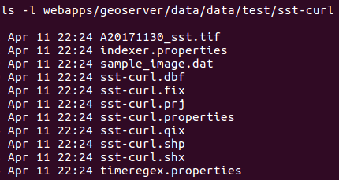

# Image Mosaic

## Illustrates how to create am image mosaic.

The examples contain 3 steps:

* Create the image mosaic
* Enable the time dimension (this is necessary as it's not done during step 1). We will set the presentation attribute to "LIST".
* Add new granules to the image mosaic

For step 1 we will need 3 files:
* A20171130_sst.tif: The initial granule corresponding to the date November 30, 2017.
* indexer.properties
* timeregex.properties

indexer.properties:
```
TimeAttribute=ingestion
Schema=*the_geom:Polygon,location:String,ingestion:java.util.Date
PropertyCollectors=TimestampFileNameExtractorSPI[timeregex](ingestion)
```

timeregex.properties:
```
regex=[0-9]{8}
```

We zip them in a file called **init.zip**.

In step 3 we will add 4 granules to the image mosaic:
* A20171201_sst.tif
* A20171202_sst.tif
* A20171203_sst.tif
* A20171204_sst.tif

We zip those 4 tif files in **granules.zip**.

The cURL commands are below. For the Python and Go (to do) examples see respected files in this folder.


### 1) Create the image mosaic 'sst-curl' in the workspace 'test'
```
curl -v -u 'admin:geoserver' -XPUT -H "Content-type:application/zip" --data-binary @init.zip http://localhost:8080/geoserver/rest/workspaces/test/coveragestores/sst-curl/file.imagemosaic
```

Here is part of the response:
```
<coverageStore>
  <name>sst-curl</name>
  <type>ImageMosaic</type>
  <enabled>true</enabled>
  <workspace>
    <name>test</name>
    <href>http://localhost:8080/geoserver/rest/workspaces/test.xml</href>
  </workspace>
  <__default>false</__default>
  <url>file:data/test/sst-curl</url>
  <coverages>
    <atom:link xmlns:atom="http://www.w3.org/2005/Atom" rel="alternate" href="http://localhost:8080/geoserver/rest/workspaces/test/coveragestores/sst-curl/file/coverages.xml" type="application/xml"/>
  </coverages>
* Connection #0 to host localhost left intact
</coverageStore>
```

A folder 'sst-curl' has been created inside the workspace's folder.  It contains the following files:



In addition to the 3 files that we uploaded, Geoserver created new ones, among which a shapefile. It is used to index the granules of our image mosaic.

If we consult the layer page of 'sst-curl' via the Geoserver graphical web interface, we see that the time dimension is not enabled:


### 2) Enable the time dimension
```
curl -v -u 'admin:geoserver' -XPUT -H "Content-type:application/xml; charset=UTF-8" -d '<coverage><enabled>true</enabled><metadata><entry key="time"><dimensionInfo><enabled>true</enabled><presentation>LIST</presentation><units>ISO8601</units><defaultValue/></dimensionInfo></entry></metadata></coverage>' http://localhost:8080/geoserver/rest/workspaces/test/coveragestores/sst-curl/coverages/sst-curl
```

Now the time dimension is enabled:


### 3) Add new granules to the image mosaic
curl -v -u 'admin:geoserver' -XPOST -H "Content-type: application/zip" --data-binary @granules.zip http://localhost:8080/geoserver/rest/workspaces/test/coveragestores/sst-curl/file.imagemosaic?recalculate=nativebbox,latlonbbox


If we check the content of 'sst-curl' folder we see that the 4 new granules have been added:


### To confirm that everything went well, consult the GetCapabilities of the workspace:
```
http://localhost:8080/geoserver/test/wms?service=wms&version=1.3.0&request=GetCapabilities
```
We can see that the 5 granules are available in the 'Dimension' tag:


**NB**: if your Geoserver is on HTTPS, end your curl command with: -k